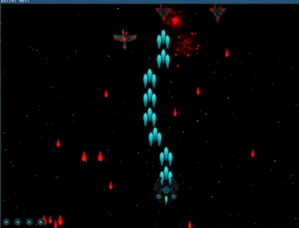

### Bullet Hell
This is a top-down space shooter game I have made some time ago with SFML. 
It is, in my opinion, quite fun, but the code isn't very good. 
I have uploaded it here not only to share it, but also to hopefully encourage myself to refactor it. 

## Building
The game is meant to be built in an appropriate build folder in the root of the project, otherwise the assets won't be found. 
A recent version of SFML needs to be installed. 

## Controls
Movement: `WASD`, `IJKL` or `arrow keys` 
Shoot: `Spacebar` 
Auto-Shoot: `G` 
Switch Ship Type: `1 2 3` or `8 9 0`

## Gameplay
The game is mostly about dodging bullets. 
There is no real way to win, just try to beat your high score and have fun. 
Here is a small gif to show the game in movement. 

## Asset Credits
Sprites are provided by Unlucky Studio. 
http://opengameart.org/content/complete-spaceship-game-art-pack 
http://unluckystudio.com 

Music by Eric Matyas. 
http://soundimage.org/sample-page/ 
As Eric requests, he is also credited in the game itself (the game over screen). 

Sound effects are from the website freesfx. 
http://www.freesfx.co.uk 

Font by Paul D. Hunt 
https://fonts.google.com/specimen/Source+Sans+Pro 